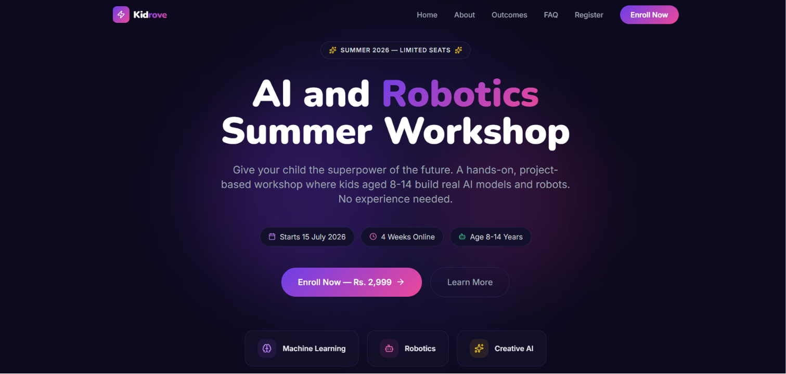

# 🤖 AI & Robotics Summer Workshop — Landing Page

A responsive workshop landing page built for Kidrove, made as part of the Infotech Wizard internship assignment.



## 🔗 Live Links

- **Live Demo:** [Add your Vercel/Netlify link here]
- **GitHub Repo:** [Add your GitHub link here]

## 🛠️ Tech Stack

**Frontend**
- React 18 + TypeScript
- Tailwind CSS
- React Hook Form + Zod (validation)
- Vite

**Backend**
- Node.js + Express + TypeScript
- MongoDB + Mongoose

## ✨ Features

- 📱 Fully responsive (Desktop, Tablet, Mobile)
- 🏠 Hero section with workshop title and Enroll Now button
- 📋 Workshop details cards (age, duration, mode, fee, start date)
- 🎯 6 learning outcome highlights
- ❓ FAQ accordion (5 questions)
- 📝 Registration form with validation, loading state, and success screen
- 🔒 Backend API with field validation and MongoDB storage

## 📁 Project Structure
workshop-landing/

├── client/    # React + TypeScript frontend

└── server/    # Express + TypeScript backend

## ⚙️ Running Locally

**Frontend**
```bash
cd client
npm install
npm run dev
```

**Backend**
```bash
cd server
npm install
npm run dev
```

Create a `.env` file inside `server/`:
PORT=5000

MONGO_URI=your_mongodb_connection_string

CLIENT_URL=http://localhost:5173

## 📡 API Endpoint

**POST** `/api/enquiry`

Request body:
```json
{
  "name": "Tanya Vaish",
  "email": "tanya@example.com",
  "phone": "9876543210"
}
```

Success response:
```json
{
  "success": true,
  "message": "Enquiry submitted successfully! We will reach out to you soon."
}
```

## 📝 My Approach

I built this project section by section using React with TypeScript and Tailwind CSS, focusing on a dark, modern aesthetic with a purple-to-pink gradient theme. The backend is an Express API with field validation connected to MongoDB for storing enquiries. The form uses React Hook Form with Zod for real-time validation, along with a loading state and success screen after submission.

## 🚀 Improvements With More Time

- ✅ Add automated tests for frontend and backend
- ✅ Add rate-limiting on the API to prevent spam
- ✅ Build an admin dashboard to view enquiries
- ✅ Send email notifications on successful registration
- ✅ Add real image/illustration assets

## 👩‍💻 Author

Built by **Tanya Vaish**